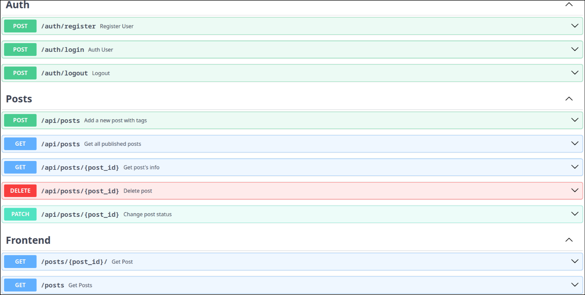
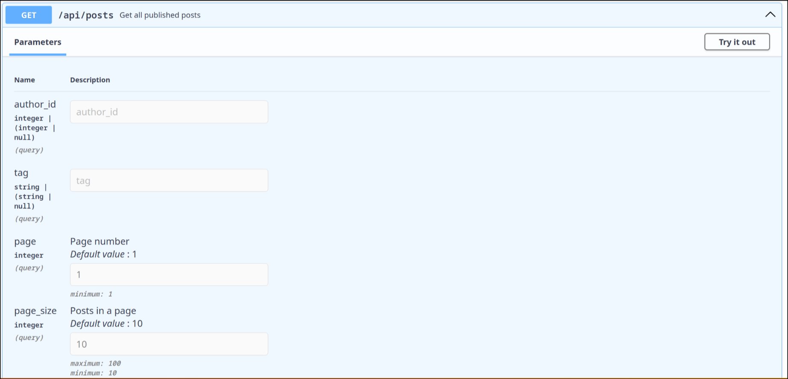

# 🌟 FastAPI Blog
This project is a RESTful mini blog written in [FastAPI](https://fastapi.tiangolo.com/) with user registration and authorization.
Interaction with database is done via [SQLAlchemy](https://www.sqlalchemy.org/), migrations via [Alembic](https://alembic.sqlalchemy.org/en/latest/)
## 📸 Screenshots
<details>
    <summary>Main page</summary>


</details>

<details>
    <summary>API interactive documentation</summary>



</details>

<details>
    <summary>Post viewing. Note: only post's author can see <i>"Move to drafts"</i> and <i>"Delete post" buttons.</i></summary>


</details>

<details>
    <summary>Filtering by tags</summary>


</details>

## ⚙️ Main features
1. **User control**:
    * Registration and authorization using cookies.
2. **Posts operations**:
    * **Post viewing**:
        * Recieving the list of all *"published"* posts.
        * Viewing the specific post.
        * Filtering posts by author or tag.
    * **Paging**:
        * Posts list is devided into pages.
        * Specific page can be requested via API.
        * Page size can be controled via API.
    * **Creation**:
        * Registered users can make new posts.
        * Post can be saved as *"draft"*.
        * New post consists of a title, a short description, a body and optional tags.
    * **Deletion**:
        * Authors can permanently remove their posts.
    * **Status changing**:
        * Post's author is able to change the post's status. Available options are *"published"* and *"draft"*.
        * Only post's author can see his drafts through API.
        * Posts with status *"published"* are seen by every user, including non-registered ones.
    * **Tags control**:
        * Posts may have multiple tags.
        * If a user create a post with unknown tag, this tag is automatically created and saved in database, so everyone can filter posts by it.
3. **Logging**:
    * **`loguru`** is used as a logging system. Though it could be done via built-in python logging, **`loguru`** has much more simple usage when extending logging logic.
4. **Module architecture**:
    * The code is divided on multiple modules(e.g. authentication, main API, pages viewing), so it is easy to scale the app .
## 🎯 Technology stack
* **Framework**: FastAPI
* **Web Server**: Uvicorn
* **ORM**: asynchronous SQLAlchemy
* **DB engine**: SQLite (can be easily swapped to any, thanks to ORM)
* **Migrations**: Alembic
* **Frontend**: Jinja2 (template engine), HTML, CSS, JS
* **Dependency management**: poetry

## 🛠️ Installation
1. Clone the repo:
    ```bash
    git clone https://github.com/bivafra/fastapiblog.git    
    cd fastapiblog
    ```
2. Install dependencies:
    ```bash
    poetry install
    ```
Note: migrations are already applied. If you want to do them manually, then consider `alembic.ini` and `app/migration/env.py` files for configure details. Then remove `alembic.ini`, `app/migration` and run:
```bash
cd app
alembic init -t async migration
alembic revision --autogenerate -m "Initial migration"
alembic upgrade head
```

## ⚡ How to run
 ```
 poetry run uvicorn app.main:app --reload
 ```
* Visit main page at [http://127.0.0.1:8000](http://127.0.0.1:8000).<br/>
* Interactive API documentation is autogenerated with **SwaggerUI** and available at [http://127.0.0.1:8000/api](http://127.0.0.1:8000/api). That means you will see nice page with all available API endpoints. Also, for now, this is the only way to interact with API for registration/authentication and posts creation. 

## What can be added/improved?
* Frontend interface for user registration/authorization, posts creation.
* Search by post's title.
* Posts commenting.
* Adding users roles(administrator, redactor, etc.)
* Switching to more common DB(e.g. postgresql)
